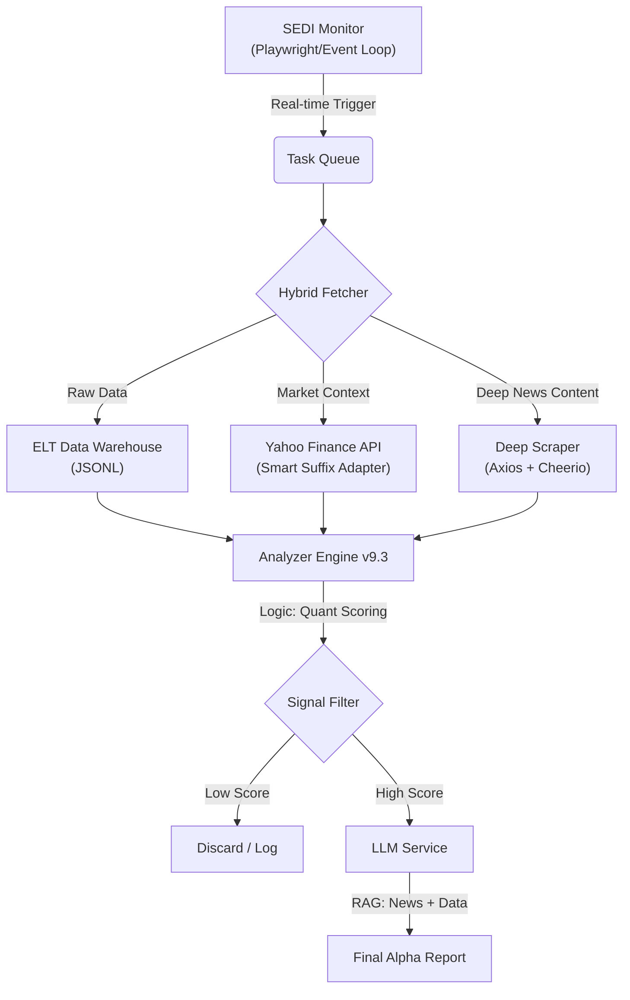

# Canadian-Insider-Radar 📈

> **An AI-Powered, Event-Driven Insider Trading Intelligence System for Canadian Markets (TSX/TSX-V/CSE).**

  

## 📖 Overview

**SEDI Alpha Capture** is a sophisticated financial data pipeline designed to detect high-conviction insider trading signals in real-time. Unlike traditional scrapers, it solves the "Data Rich, Information Poor" problem by distinguishing opportunistic "Whale Buys" from routine automated plans.

It employs a **Hybrid Ingestion Architecture** (Playwright for triggers + Axios for data) and an **AI-Driven RAG (Retrieval-Augmented Generation) Pipeline** to audit financial news, ensuring signals are backed by "Ground Truth" context.

## 🏗️ System Architecture



*(Note: The above is a conceptual flow. In the terminal, it renders as a structured log stream.)*

## ✨ Key Features & Technical Highlights

### 1. Hybrid Data Ingestion (Engineering)

* **The Challenge:** Real-time SEDI feeds are unstructured HTML, while structured APIs are hidden or rate-limited.
* **The Solution:** Implemented a **Producer-Consumer** model. A headless browser ("The Scout") monitors feeds for triggers, while a reverse-engineered internal API client ("The Fetcher") retrieves structured data.
* **Result:** Reduced latency by 90% compared to full-page scraping.

### 2. Smart Scoring Engine (Quantitative)

Implements academic-grade logic (Cohen-Malloy-Pomorski) to filter noise:

* **Grant Isolation (Noise Filter):** Strictly excludes "Compensation" transactions (Codes 50-56). Only "Out-of-pocket" Open Market buys (Code 10) contribute to the conviction score.
* **Whale Impact:** Detects trades exceeding **0.1% of Market Cap**.
* **Robot Consensus Defense:** Automatically penalizes "consensus" signals if >50% of participants are executing Auto-Plans (DRIP/ESPP).
* **Dilution Guard:** Applies a -40 point penalty to Private Placements unless hedged by Open Market buying.

### 3. Deep RAG Intelligence (AI)

* **Problem:** LLMs hallucinate when given only headlines (e.g., interpreting a "Dilutive Financing" headline as positive).
* **Solution:** Built a **Deep RAG Pipeline** that fetches the full article body (first 1.5k chars).
* **Resilience:**
    * **Dual-Search:** Queries both Ticker and Company Name to ensure coverage for micro-caps.
    * **Header Overflow Fix:** Optimized Node.js runtime (`--max-http-header-size=81920`) to handle massive cookies from modern financial sites.
    * **Neo-Theme Adaptability:** Uses heuristic CSS selectors (`data-testid`) to scrape dynamic Yahoo Finance pages.

## 🚀 Installation & Deployment

### Prerequisites

* Node.js v18+
* An OpenAI-compatible LLM endpoint (e.g., Local Proxy for Gemini, DeepSeek, or OpenAI).

### 1. Clone the Repository

```bash
git clone [https://github.com/yourusername/Canadian-Insider-Radar.git](https://github.com/yourusername/Canadian-Insider-Radar.git)
cd Canadian-Insider-Radar
npm install

```

### 2. Configuration

Create a `.env` file in the root directory.
**Security Note:** Never commit this file.

```ini
# --- Data Source Credentials (SEDI/CEO.CA) ---
CEO_EMAIL=your_email@example.com
CEO_PASSWORD=your_secure_password

# --- AI Service Configuration ---
# Example: Local Proxy forwarding to openAI compatible resource
LLM_BASE_URL=http://localhost:8000/openai/v1
LLM_API_KEY=sk-xxxxxx
LLM_MODEL=gemini-2.5-flash

```

### 3. Run the System

Start the production pipeline.
*Note: We increase the HTTP header size to bypass anti-scraping measures on news sites.*

```bash
npm run dev

```

## 📊 Sample Output (Log)

```text
👀 ============ ============ 👀
   📊 Market: Price $16.50 | Cap $3,850.5M | AvgVol 450200
   🧠 [AI] Triggered for LUG (Score: 140).
   🔗 SEDI Audit: [https://ceo.ca/content/sedi/issuers/00036644](https://ceo.ca/content/sedi/issuers/00036644)

   📰 News Context (1 articles):
      - [2026-01-05] Lundin Gold Reports Record Production (✅ Deep Read)
        🔗 [https://finance.yahoo.com/news/lundin-gold](https://finance.yahoo.com/news/lundin-gold)...

   🧠:
      **🐂 BULL THESIS**
      - Production beat guidance by 15%, aligning with the CEO's $500k open market buy.
      - Cash flow is sufficient to fund expansion without dilution.
      **⚖️ VERDICT**
      - BULLISH. Strong fundamental catalyst backing the insider conviction.
   --------------------------------------------------
   🎯 🔥🔥 R. Hochstein (CEO)
      Score: 140 | Net: $525,000
      Details: 2026-01-08 @ $16.45
      Reasons: 🔥 Market Buy, 🐋 Whale (0.15% MC), 📈 Uptrend
   --------------------------------------------------
   
```

## 🔮 Roadmap

* [ ] **Telegram Bot Integration:** Push Markdown reports to mobile.
* [ ] **Visual Dashboard:** Frontend visualization for "Whale Impact" timeline.
* [ ] **Multi-Source News:** Integrate CEO.ca Pro feed for CSE-listed coverage.

## 📄 License

MIT